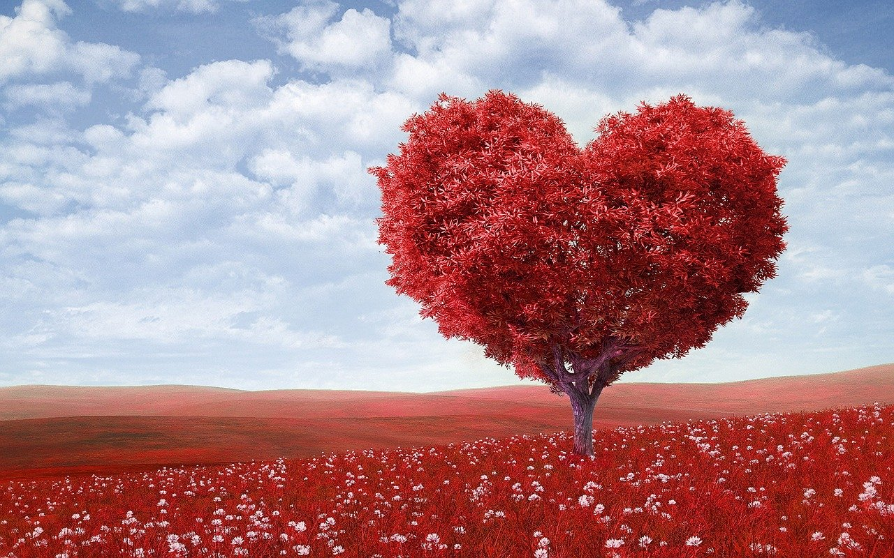
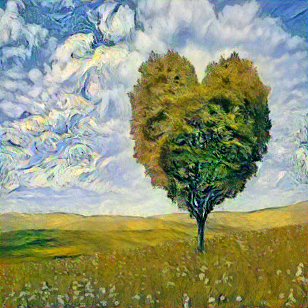
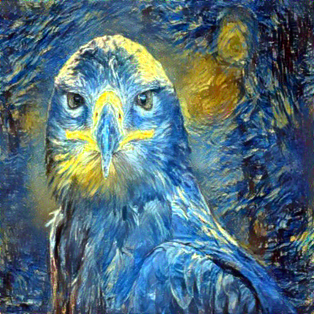
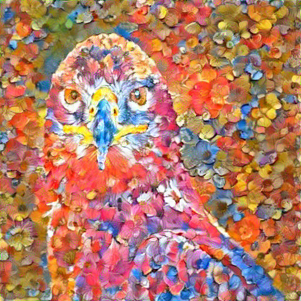
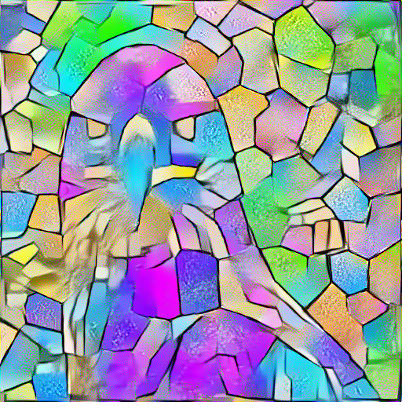
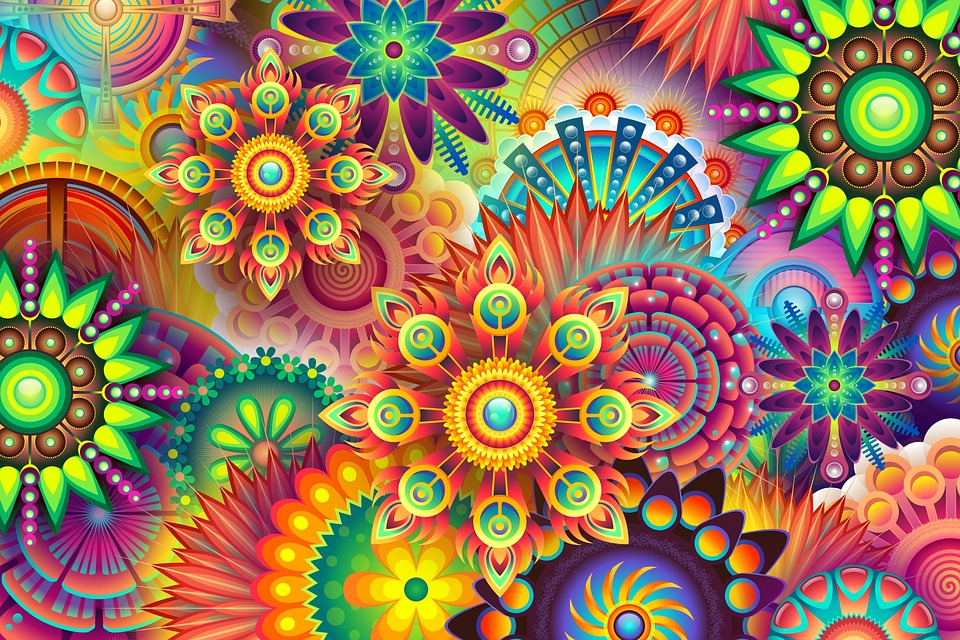

# Neural Style Transfer in PyTorch

## Motivation
This project was implemented as an attempt of partially recreating the original [neural style transfer paper](https://www.cv-foundation.org/openaccess/content_cvpr_2016/papers/Gatys_Image_Style_Transfer_CVPR_2016_paper.pdf). I've added some modifications to my implementation though.

## Neural Style Transfer
Neural Style Transfer is an algorithm which takes two images as input (content image and style image) and combines them into a new image. The new image will keep the *content* of the **content input image** and will capture the *style* of the **style input image**. Algorithm uses CNNs to achieve this.

# Implementation 
Input images are rescaled to 512x512. Rescale parameters can be modified in the [globals.py](utils/globals.py) file. Input images are normalized to the [0,1] range as proposed in the paper. The algorithm uses *L-BFGS* optimizer as a default one as proposed in the paper. The optimizer can be changed to Adam the same way as rescale parameters.

The paper suggests the usage of layers: conv1_1, conv2_1, conv3_1, conv4_1 and conv5_1 for style loss and layer conv4_2 for content loss. I used ReLU outputs applied to those layers (ReLU:inplace=False). 

# Results

| Content    | Style    | Generated    |
:-----------:|:--------:|:-------------:
||

**More styles applied to the content picture above**

    

### Other interesting results:
| Content  | Style   | Generated   |
:---------:|:-------:|:------------:
||

  

  

  

# References
While implementing this I've found [Aleksa's repo](https://github.com/gordicaleksa/pytorch-neural-style-transfer) as very helpful.
Also PyTorch has an amazing [tutorial](https://pytorch.org/tutorials/advanced/neural_style_tutorial.html) on Neural Style Transfer.

Images were downloaded from [Pixabay](https://pixabay.com/).
